# This is a Python library for Search and Optimization.

This is a library for search and optimization algorithms. The basic topics are covered which include Descent Method, Stochastic Search, Path Search, MDP-related and RL related algorithms.

# Table of Contents

- [This is a Python library for Search and Optimization.](#this-is-a-python-library-for-search-and-optimization)
- [Table of Contents](#table-of-contents)
- [Documentation](#documentation)
- [Numerical Optimization](#numerical-optimization)
  - [Gradient Descent](#gradient-descent)
  - [Newton Method](#newton-method)
  - [Conjugate Descent](#conjugate-descent)
- [Stochastic Search](#stochastic-search)
  - [Simulated-Annealing](#simulated-annealing)
    - [Travelling Salesman Problem](#The-Travelling-Salesman-Problem-on-Simulate-Annealing)
  - [Cross Entropy Methods](#cross-entropy-methods)
  - [Search Gradient](#search-gradient)
- [Classic-Search](#classic-search)
  - [Depth-First Search (DFS)](#depth-first-search-dfs)
  - [Breadth-first search (BFS)](#breadth-first-search-bfs)
  - [Dijkstra](#dijkstra)
  - [A*](#a)
  - [MinMaxSearch](#MinMaxSearch)
- [Markov Decision Process](#Markov-Decision-Process)
  - [Value Iteration](#Value-Iteration)
  - [Policy Iteration](#Policy-Iteration)
  - [Q-Learning](#Q-Learning)
    - [BlackJack](#BlackJack)
- [Monte-Carlo Tree Search](#Monte-Carlo-Tree-Search)
  - [Gomoku Game](#Gomoku-Game)

# Documentation

1. Clone this repo.
   
   git clone this repo
   
# Numerical Optimization

*Numerical Optimization* presents a comprehensive and up-to-date description of the most effective methods in continuous optimization.

### Gradient Descent

Gradient Descent is widely used in optimization and machine learning areas because its simple calculation. It tries to take a small step towards the gradient descent direction to minimize the function.

Example Function: 

- With a fixed learning rate [Code](NumericalOptimization/gradientDescentWithFixedRate.py)
  
  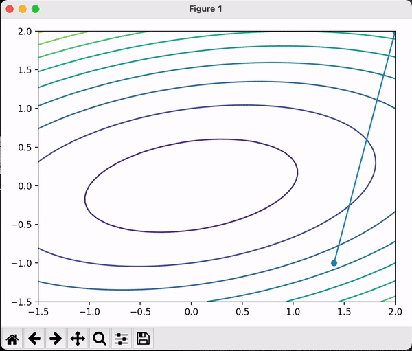

- With a Optimal learning rate [Code](NumericalOptimization/gradientDescentWithOptimalRate.py)

    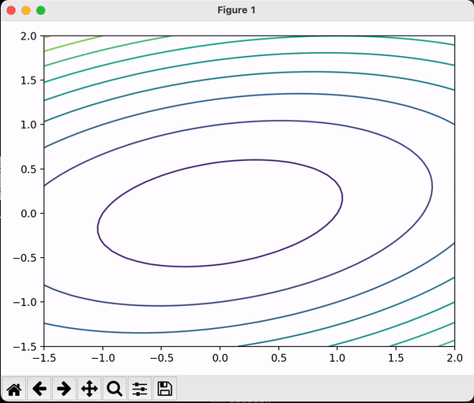

### Newton Method

Example Function: [Code](NumericalOptimization/NewtonMethod.py)

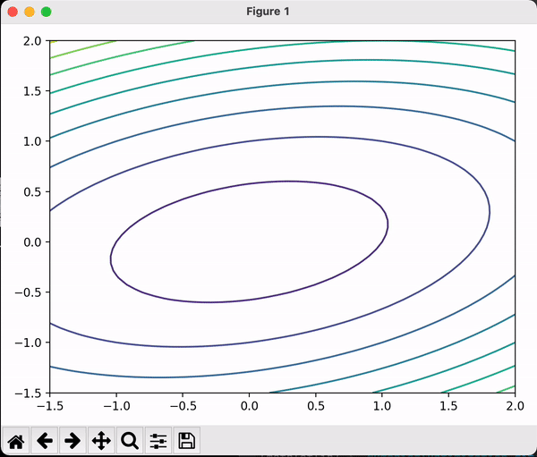

Newton's method is a powerful technique—in general the [convergence](https://en.wikipedia.org/wiki/Rate_of_convergence) is quadratic: as the method converges on the root, the difference between the root

However fast and do not need a step size (learning rate), Newton's Method has some drawbacks and caveats:

- The computation cost of inverting the Hessian could be non-trivial.

- It does not work if the Hessian is not invertible.

- It may not converge at all, but can enter a cycle having more than 1 point.

- It can converge to a saddle point instead of to a local minimum

Reference:

See details on [Newton's method in optimization - Wikipedia](https://en.wikipedia.org/wiki/Newton%27s_method_in_optimization)

### Conjugate Descent

For quadratic problems, we can do better than generic directions of gradient. In Gradient Descent if we take the steepest descent, we always go onthogonal in every step. Can we go faster? Yes, Newton's method gives us a faster one. But at the same time, we also want to avoid calculating the inversion of certain matrics. Conjugate gradients give us a better way to perform descent method because they allow us to minimize convex quadratic objectives in at most n steps and without inverting the matrics.

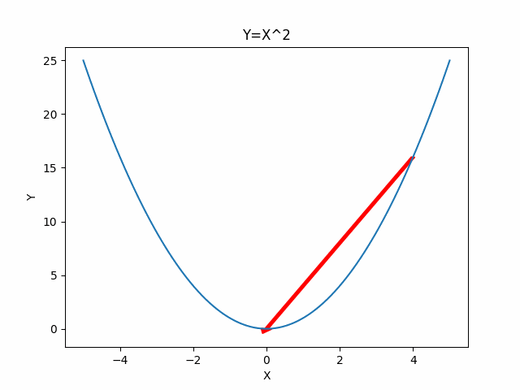

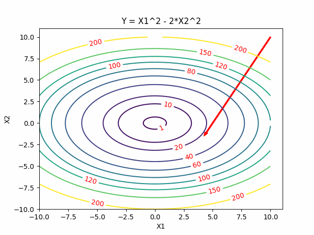

# Stochastic Search

In some cases, we do not want to or cannot calculate the first or second derivate of the function. Or there are numerous local minimas of the function and the descent methods not work well. Instead, we can introduce some randomness into the optimization. Here we will cover algorithms including Simulated Annealing, Cross Entropy Method and Search Gradient.

## Simulated-Annealing

Intuitively, Simulated Annealing is to start from one point, dive into the function and walk randomly, go downhill when we can but sometimes uphill to explore and try to jump out of this sub-optimal local minimum. We expect to gradually settle down by reducing the probability of exploring.

For problems where finding an approximate global optimum is more important than finding a precise local optimum in a fixed amount of time, simulated annealing may be preferable to exact algorithms like descent methods.

Here is the visualization of Simulated Annealing:

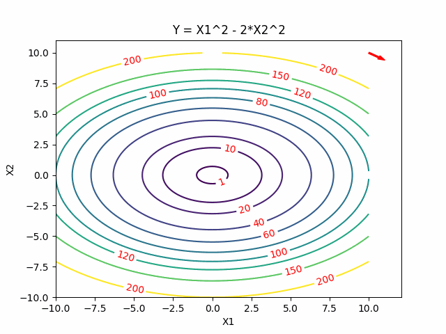

#### The Travelling Salesman Problem on Simulate Annealing

Simulated annealing algorithm is a random algorithm, it has a certain probability to find the global optimal solution

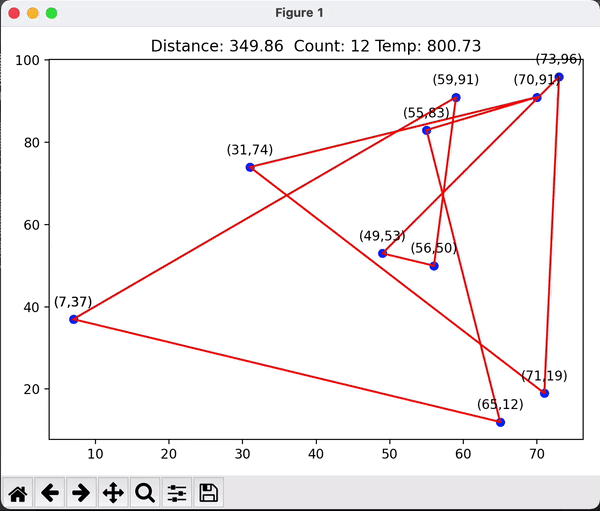

# Cross Entropy Methods

Instead to take one sample of the function, Cross Entropy Methods sample a distribution. The key idea behind that is that finding a global minimum is equivalent to sampling a distribution centered around it.

Cross Entropy Methods first start with an initial distribution (often a diagonal Gaussian), and then select a subset of samples with lower function values as elite samples. Then update the distribution to best fit those elite samples.

Here is the visualization of CEM, where red points are elite samples.

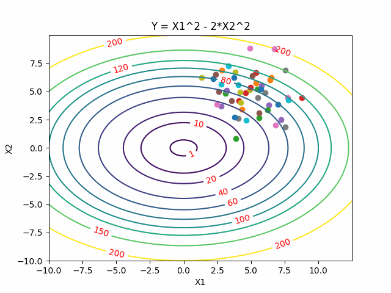

# Search Gradient

In high dimensions, it can quickly become very inefficient to randomly sample. Ideally, we can use the derivative of the expectation of function value on the distribution we sampled, so that we can move the distribution in the direction that imroves the expectation. So Search Gradient borrows the idea of Gradient Method to do stochastic search. The overall algorithm uses this idea combined with log techniques, see reference for details.

Here is the visualization of Search Gradient:

# Classic-Search

Path Searching Algorithms including DFS (Depth First Search), BFS (Breadth First Search), UCS(Uniform Cost Search) are formulated in terms of weighted graphs: starting from a specific starting node of a graph, it aims to find a path to the given goal node having the smallest cost (least distance travelled, shortest time, etc.). They maintains a tree of paths originating at the start node and extending those paths one edge at a time until its termination criterion is satisfied. Whereas these algorithms are all uninformed search: you don't know where you are unless you happen to hit the goal, A* search is a informed search with heuristic function to measure how close you are to the goal.

Intuitively, it not only take account of the cost-to-come but also cost-to-go. We can see it as a special case of UCS whereas it uses the cost of real cost plus heuristic cost by adopting a heuristic function.

### Depth-First Search (DFS)

The algorithm starts at the root node (selecting some arbitrary node as the root node in the case of a graph) and explores as far as possible along each branch before backtracking.

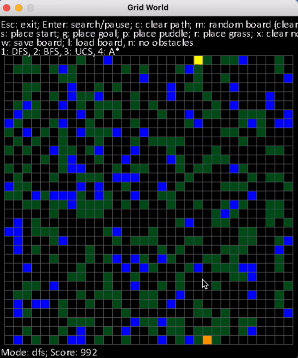

### Breadth-first search (BFS)

It starts at the tree root and explores all nodes at the present depth prior to moving on to the nodes at the next depth level. Extra memory, usually a queue is needed to keep track of the child nodes that were encountered but not yet explored.

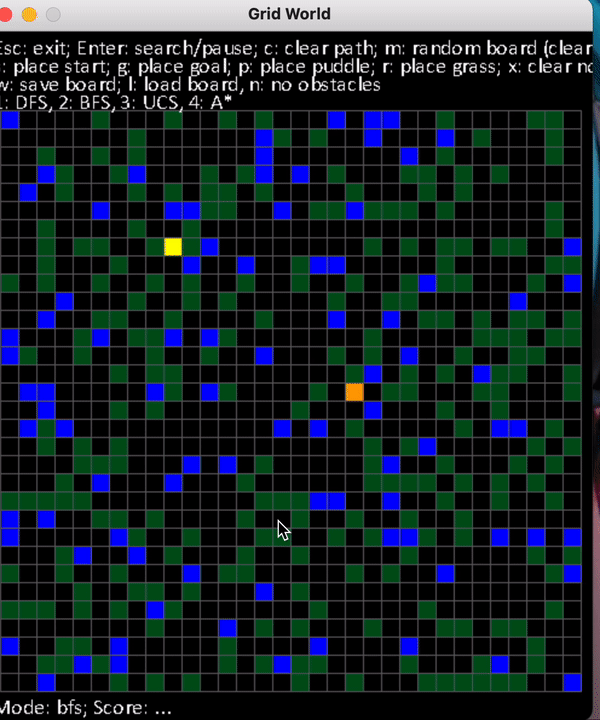

### Dijkstra

For a given source node in the graph, the algorithm finds the shortest path between that node and every other with cost

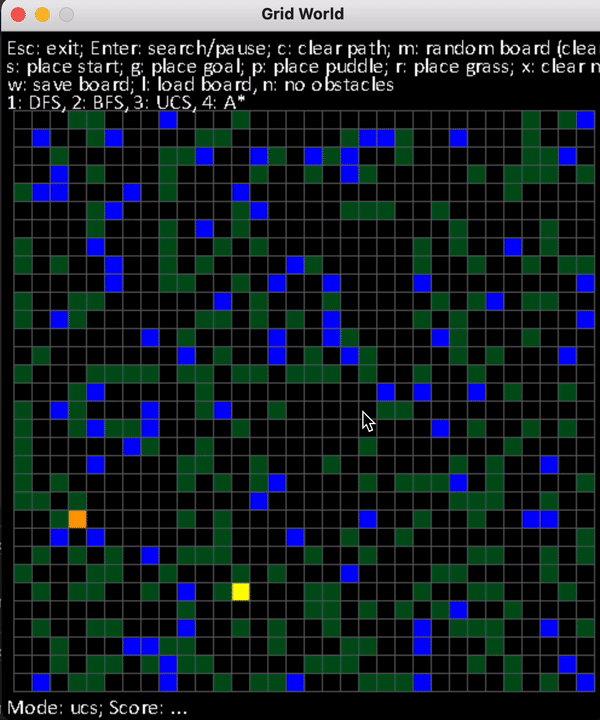

### A*

A* is an informed search algorithm, **or a best-first search**, meaning that it is formulated in terms of weighted graphs: starting from a specific starting node of a graph, it aims to find a path to the given goal node having the smallest cost

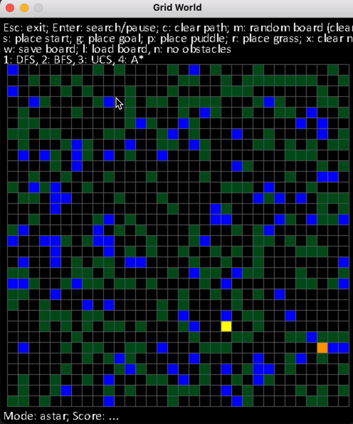

### MinMaxSearch

uppose we are playing games with another one in turn. At the end of the game, there are certain payoffs. In the game, we make every move to maximize our the benefit or value and the opponent tries to minimize it. We can use Minimax Search on this max-min-player game to calculate every value of a tree node and then make the best move.

Minimax Search

Suppose we are playing games with another one in turn. At the end of the game, there are certain payoffs. In the game, we make every move to maximize our the benefit or value and the opponent tries to minimize it. We can use Minimax Search on this max-min-player game to calculate every value of a tree node and then make the best move.

Here is the visualization for Minimax Search. The max players are the green nodes and blue nodes are the min players. At the end of the game, there are payoffs as grey nodes. Minimax calculate every nodes' value and the choice from bottom to top, visualized as orange texts and arrows. Finally as the root max player, the red nodes and arrows are showed as how we should play the game to get the maximum benefit.

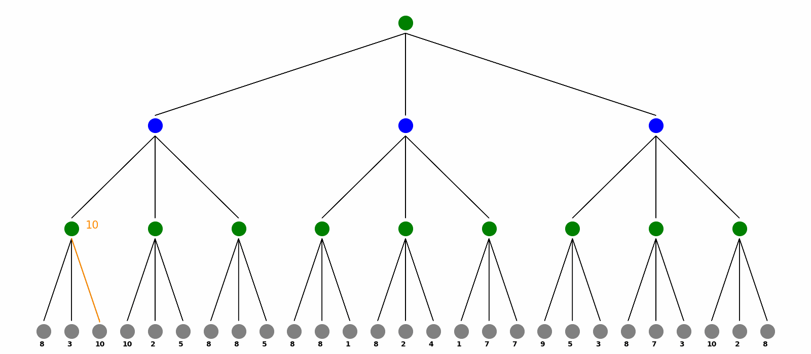

#### 2048 Game

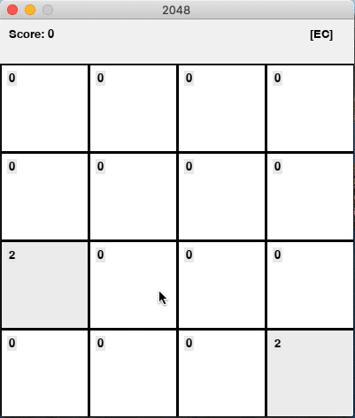

   

# Markov Decision Process

A Markov decision process is composed of states, actions, transition probabilities and reward of states. It provides a mathematical framework for modeling decision making in situations where outcomes are partly random and partly under the control of a decision maker. At each states, we not only want to maximize the short-term reward but also long-term. So evaluating the value of a state is essential in MDP.

Value Iteration and Policy Iteration are algorithms where we have the full knowledge of the MDP (the transition probabilities are known), computing the optimal policy and value.

### Value Iteration

Value Iteration start with arbitrary state value and use Bellman Update to update the values and pick the best policy.

Here is the visualization. Green nodes are state node and blue nodes are the environment with the transition probability on the arrow pointing to the next state. When we do Bellman Update on a certain state, it will be marked as red and a new value is updated on its left. The best action is labeled as red arrow. We do Bellman Update for rounds until it converges.

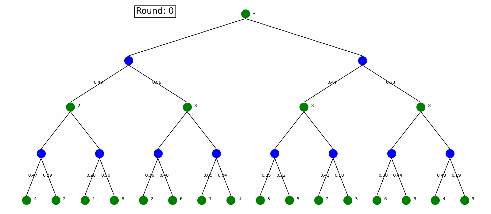

### Policy Iteration

Policy Iteration starts with an arbitrary policy and solve the Bellman Equations to evaluate the values defined by the policy, then check each state to see if we can improve the max value. We keep doing this until the policy is fixed.

Here is the visualization on the same MDP as in the Value Iteration. Nodes and arrows are the same as in Value Iteration, where as every state start with an arbitrary policy and update it every round.

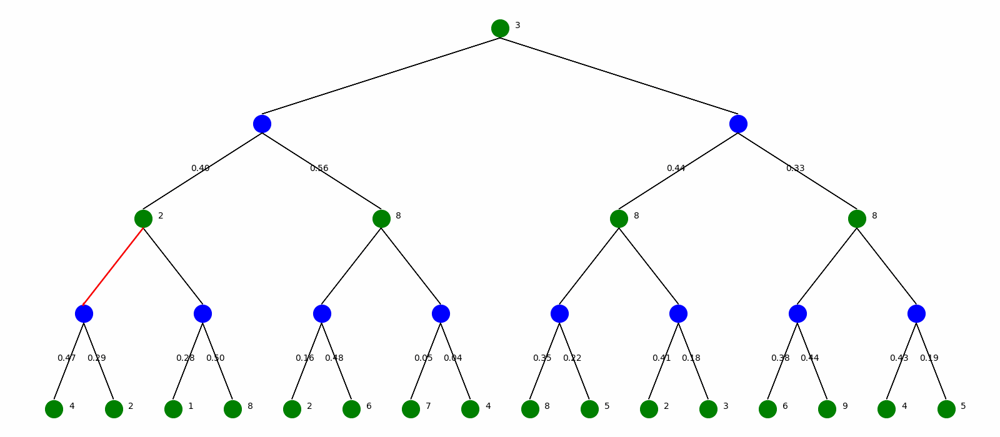

### Monte Carlo Policy Evaluation

Monte Carlo Policy Evaluation simulates a lot of state sequences and use the average as the value of states.

The visualization is as follow. Every time the algorithm generate a sequence of states and calculate their values and use the average as the value of states. Note that every state only have one action which is the fixed policy.

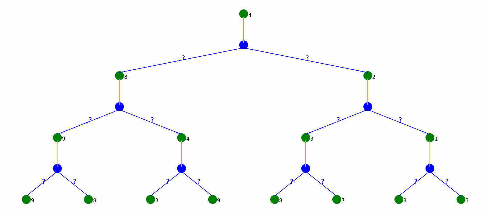

### Temporal Difference Policy Evaluation

Monte Carlo Policy Evaluating generate the whole sequence every time, which could be very time-consuming and even not practical when the MDP is infinite or has circles. Temporal Difference Policy Evaluation, however, utilizes the Bellman Equations and update on the way, without waiting for full sequences. In every step, it updates estimated values based on next sampled state without waiting for a final outcome.

Here is the visualization. Each round we only update state values based on the next state.

### Q-Learning

Monte Carlo Policy Evaluation and Temporal Difference Policy Evaluation only estimate the state values given the fixed policy. But how can we take the best action in MDP without a transition model? Q-learning solves the problem of learning about the environment and improving policy at the same time.

It starts with knowing nothing and pick actions based on epsilon-greedy policy (choose either exploration or exploitation with epsilon probability), and then update the value of state taking certain action, which is Q-value. By updating the Q-value on the fly, the policy will provably converge to the optimal.

The visualization is as follow. We plot Q-value Q(s,a) in red next to the environment nodes. After Q-Learning, we can output a policy without knowing the transition model.

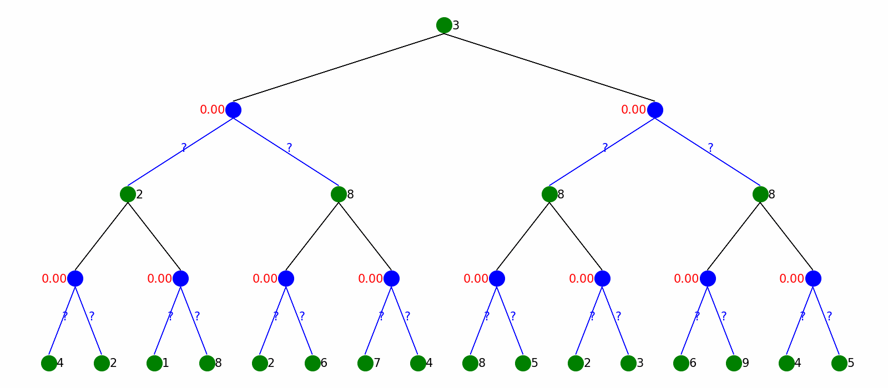

#### BlackJack

Base on the previous algorithem, the Ai win rate can reach to the 40%

## Monte-Carlo Tree Search

Usually, the game tree can be extremely large like chess game which can take an impractical amount of time to do a full search of the game tree. Instead of growing game tree fully, we can use Monte-Carlo Tree Search to smartly grow game tree and ultimately make actions.

#### Gomoku Game

Players alternate turns placing a stone of their color on an empty intersection. Black plays first. The winner is the first player to form an unbroken chain of five stones horizontally, vertically, or diagonally. Placing so that a line of more than five stones of the same color is created does not result in a win. These are called overlines

note that I only put 1000 bugets for computer, so I can still lie to computer. If I can give more bugets, it will become smarter

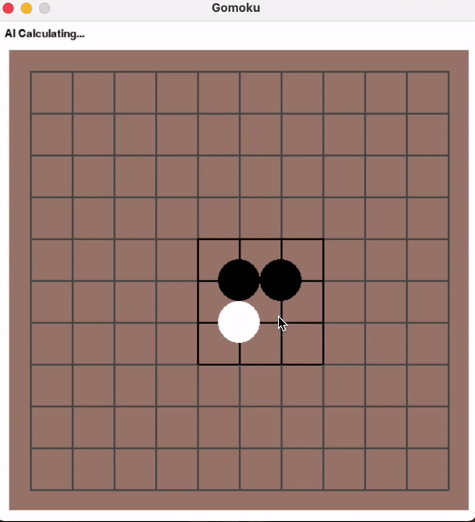
